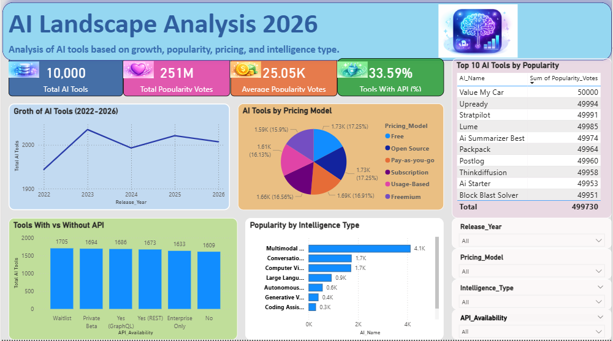

# 🤖 AI Landscape Analysis 2026
AI tools analysis (2022–2026) using Excel, Python, SQL and Power BI

## 📌 Overview
This project analyzes the AI tools ecosystem from 2022 to 2026, focusing on growth trends, popularity, pricing models, and intelligence types. The goal is to understand how AI tools are evolving over time.

## 🛠 Tools Used
- Excel
- Python
- SQL
- Power BI

## 📊 Key Metrics
- Total AI Tools: 10,000  
- Total Popularity Votes: 251M  
- Average Popularity Votes: 25.05K  
- Tools with API: 33.59%  

## 📈 Key Insights
- AI tools saw significant growth between 2022 and 2023, followed by slight fluctuations  
- Free and Freemium pricing models are widely used  
- Majority of tools provide API access, but still a large portion do not  
- Multimodal and Conversational AI tools are the most popular categories  
- Popularity varies significantly across different intelligence types  

## 📂 Files Included
- dataset.csv → AI tools dataset  
- dashboard.pbix → Power BI dashboard  

## 📸 Dashboard Preview

## 🎯 Conclusion
The AI industry is rapidly expanding with diverse tools across multiple categories. Pricing flexibility and API availability play a key role in tool adoption and popularity.

## 📄 Resume
[Download Resume](https://github.com/Sowjanya-jakkula/resume/blob/main/Resume.pdf)
